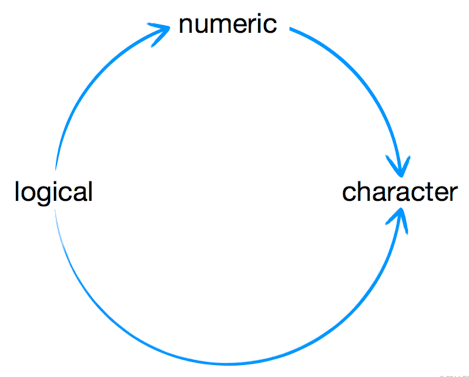

# Introducción a R

## Operaciones básicas

### R como calculadora

```r
5 + 5
# 10

4 - 1
# 3

1 * 2
# 2

4 ^ 2
# 16
```

### Algebra con variables

Una manera de asignar variables en R es `var <- valor` (hay otras posibilidades). Las variables creadas pueden ser reasignadas o borradas con `rm(var)`.

```r
a <- 1
b <- 2

a + b
# 3

A <- 3

a + b - A
# 0
```


Y hay otras funciones que permiten hacer cálculos mucho más complicados:

```r
round(3.1415)
# 3

factorial(3)
# 6 -- 3! = 3 x 2 x 1

sqrt(9)
# 3
```

¿Qué piensas que devolverá esta operación?[^Pista]

```r
factorial(round(2.0015) + 1)
```
[^Pista]: Es como en Excel o en una calculadora (siempre de los paréntesis más anidados hacia los exteriores).


## Tipos de datos

Existen muchos tipos de datos, pero los más básicos son cuatro:

- numeric
- character strings (texto)
- logical (T/F)
- factor
- ...

### numeric

```r
1 + 1
3000000
class(0.00001)
# "numeric"
```

### character

Utilizando comillas

```r
"hello"
class("hello")
# "character"

"hello" + "world"
# Error
!
nchar("hello")
# 5
!
paste("hello", "world")
# "hello world"
```

### logical

Verdadero o falso (TRUE/FALSE)

```r
3 < 4
# TRUE
class(TRUE)
# "logical"
class(T)
# "logical"
```

### factor

Util para datos categoricos. R guarda numeros enteros con etiquetas asociadas (*levels*).

```r
fac <- factor(c("a", "b", "c"))
fac
# a b c
# Levels: a b c

class(fac)
# factor
```

### Coerción de un tipo de dato

Es importante ya que se pueden perder datos



Manualmente también se puede forzar un *cast* entre tipos

```r
as.numeric("1")
as.character(TRUE)
as.logical(1)
as.factor("john")
```

## Estructuras de datos

### Vectores

Un vector puede combinar varios elementos ordenados en un array unidimiensional. Las operaciones que apliquemos se comportan de acuerdo a la naturaleza de los vectores.

```r
vec <- c(1, 2, 3, 10, 100)
vec
# 1 2 3 10 100

vec + 4
# 5 6 7 14 104

vec * 4
# 4 8 12 40 400

vec * vec
# 1 4 9 100 10000
```

### Matrices

Una matriz puede combinar varios elementos en un array bidimiensional

```r
mat <- matrix(c(1, 2, 3, 4, 5, 6), nrow = 2)
mat
#      [,1] [,2] [,3]
# [1,]   1    3    5
# [2,]   2    4    6
```

```r
mat <- matrix(c(1, 2, 3, 4, 5, 6), nrow = 3)
mat
#      [,1] [,2]
# [1,]   1    3
# [2,]   2    4
# [2,]   5    6
```

Trasponer una matriz

```r
t(mat)
#      [,1] [,2] [,3]
# [1,]   1    3    5
# [2,]   2    4    6
```

### Arrays multidimensionales

Aunque es menos habitual también podemos estructurar nuestros datos en más dimensiones.

```r
array(c(1, 2, 3, 4, 5, 6), dim = c(2, 2, 3))

#, , 1

#     [,1] [,2]
#[1,]    1    3
#[2,]    2    4

#, , 2

#     [,1] [,2]
#[1,]    5    1
#[2,]    6    2

#, , 3

#     [,1] [,2]
#[1,]    3    5
#[2,]    4    6
```


### Listas

Una lista es un grupo unidimensional de objetos de R. Los elementos de una lista pueden ser cualquier objeto, incluso vectores u otras listas.

```r
lst <- list(1, "R", TRUE)
class(lst)
# "list"

list(c(1, 2), TRUE, c("a", "b", "c"))
```


### Data Frames

Un data frame es un grupo bidimensional de objetos de R. Cada columna puede tener un tipo diferente.

```r
df <- data.frame(c(1, 2, 3),
c("R","S","T"), c(TRUE, FALSE, TRUE))
class(df)
# "data.frame"
```

## Nombres (names)

Los elementos de un vector, lista o data frame pueden llevar un nombre asociado.

**Esto es muy distinto a una hoja de cálculo**.


### Nombrar al  crear el objeto

```r
nvec <- c(one = 1, two = 2, three = 3)

nvec
# one two three
#   1   2     3
```

```r
nlst <- list(one = 1, two = 2,
many = c(3, 4, 5))

nlst
# $one
# [1] 1
#
# $two
# [1] 2
#
# $many
# [1] 3 4 5
```


```r
ndf <- data.frame(numbers = c(1, 2, 3),
	letters = c("R","S","T"),
	logic = c(TRUE, FALSE, TRUE))

ndf
#    numbers letters logic
# 1        1       R  TRUE
# 2        2       S FALSE
# 3        3       T TRUE
```


### Renombrar elementos de un objeto

Los nombres también pueden ser asignados una vez creado el objeto.

```r
names(ndf)
# [1] "numbers" "letters" "logic"

names(nvec)
# [1] "one" "two" "three"

names(nvec) <- c("uno", "dos", "tres")
nvec
# uno dos tres
#   1   2    3
```

Cada estructura de datos tiene funciones que permiten algunas opciones básicas


## Funciones
