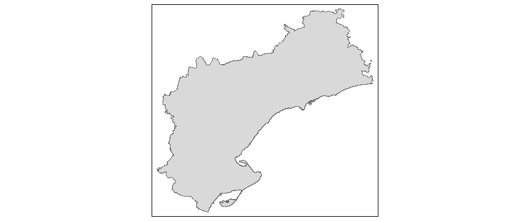

# Gráficos y mapas con R

Con el ánimo de entender mejor la sintaxis y las funciones disponibles vamos a explorar los siguientes ejemplos:

## Gráficos simples

- [Producing Simple Graphs with R](https://www.harding.edu/fmccown/r/)
- [Quick-R](https://www.statmethods.net/graphs/index.html)

¿Os atrevéis a crear un climograma con lo visto hasta aquí?

## Gráficos con ggplot2

- Comparación entre ggplot2 y base graphics [link](https://tutorials.iq.harvard.edu/R/Rgraphics/Rgraphics.html).
- [r-statistics.co](http://r-statistics.co/Top50-Ggplot2-Visualizations-MasterList-R-Code.html).
- [r-graph-gallery](https://www.r-graph-gallery.com/portfolio/ggplot2-package/).

## Mapas

- [Making maps in R](https://cengel.github.io/rspatial/4_Mapping.nb.html).
- Demos con tmap ([World](https://github.com/mtennekes/tmap/tree/master/demo/WorldFacets) y [USA](https://github.com/mtennekes/tmap/tree/master/demo/USChoropleth)).
- [tmap in a nutshell](https://cran.r-project.org/web/packages/tmap/vignettes/tmap-nutshell.html#quick-thematic-map).
- [Spatial data and tmap](https://gotellilab.github.io/Bio381/StudentPresentations/SpatialDataTutorial.html).


## Mapa mudo de Tarragona con `tmap`

Vamos a descargar nuestros propios datos del Centro de Descargas del [CNIG](http://centrodedescargas.cnig.es/CentroDescargas/index.jsp#)

El fichero a descargar está dentro del apartado de Información Geográfica de Referencia:

- líneas límite (*recintos_provinciales_inspire_peninbal_etrs89.shp*).

Con estos datos, obtendríamos un `Quick Thematic Map` de la siguiente manera:

```r
library(rgdal)
shp<-readOGR(".","recintos_provinciales_inspire_peninbal_etrs89")

tarragona<-shp[shp@data$NAMEUNIT=="Tarragona", ]
plot(tarragona)

library(tmap)
qtm(tarragona)
```

