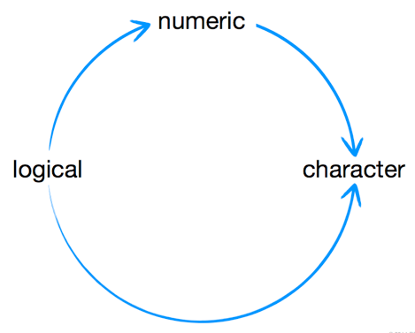

# Introducción a R

## Operaciones básicas

### R como calculadora

```r
5 + 5
# 10

4 - 1
# 3

1 * 2
# 2

4 ^ 2
# 16
```

### Algebra con variables

Una manera de asignar variables en R es `var <- valor` (hay otras posibilidades). Las variables creadas pueden ser reasignadas o borradas con `rm(var)`.

```r
a <- 1
b <- 2

a + b
# 3

A <- 3

a + b - A
# 0
```


Y hay otras funciones que permiten hacer cálculos mucho más complicados:

```r
round(3.1415)
# 3

factorial(3)
# 6 -- 3! = 3 x 2 x 1

sqrt(9)
# 3
```

¿Qué piensas que devolverá esta operación?[^Pista]

```r
factorial(round(2.0015) + 1)
```
[^Pista]: Es como en Excel o en una calculadora (siempre de los paréntesis más anidados hacia los exteriores).


## Tipos de datos

Existen muchos tipos de datos, pero los más básicos son cuatro:

- numeric
- character strings (texto)
- logical (T/F)
- factor
- ...

### numeric

```r
1 + 1
3000000
class(0.00001)
# "numeric"
```

### character

Utilizando comillas

```r
"hello"
class("hello")
# "character"

"hello" + "world"
# Error
!
nchar("hello")
# 5
!
paste("hello", "world")
# "hello world"
```

### logical

Verdadero o falso (TRUE/FALSE)

```r
3 < 4
# TRUE
class(TRUE)
# "logical"
class(T)
# "logical"
```

### factor

Util para datos categoricos. R guarda numeros enteros con etiquetas asociadas (*levels*).

```r
fac <- factor(c("a", "b", "c"))
fac
# a b c
# Levels: a b c

class(fac)
# factor
```

### Coerción de un tipo de dato

Es importante ya que se pueden perder datos



Manualmente también se puede forzar un *cast* entre tipos

```r
as.numeric("1")
as.character(TRUE)
as.logical(1)
as.factor("john")
```

